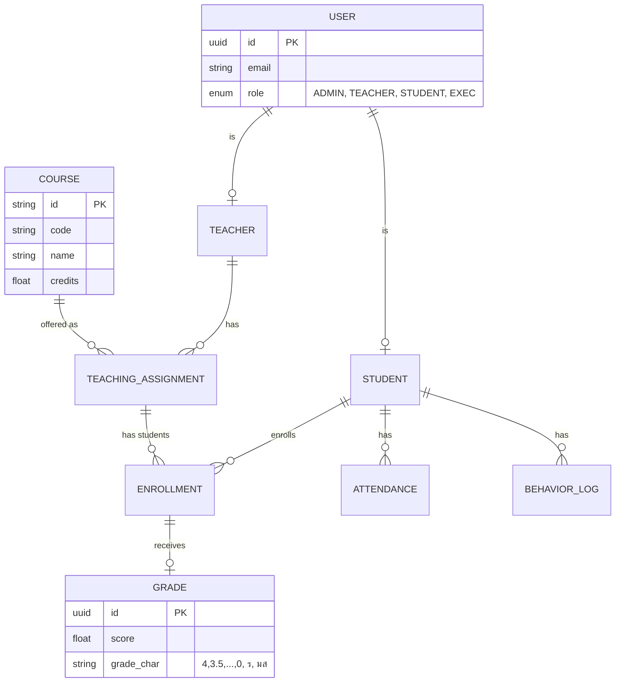

# Database Schema & Data Models

เอกสารอ้างอิงโครงสร้างฐานข้อมูล (PostgreSQL / Prisma) สำหรับ Satit MCU System

## 1. ER Diagram

## 2. Key Entities (Prisma Model แนวทาง)
- **User:** จัดการ Auth ผูกกับ Supabase Auth
- **Student:** ข้อมูลส่วนตัว, รหัสนักเรียน, แผนการเรียน, เกรดสะสม (GPAX)
- **Teacher:** ข้อมูลครู
- **Course:** รายวิชา (รหัสวิชา, ชื่อ, หน่วยกิต)
- **TeachingAssignment:** ตารางสอน/ภาระงานสอน (ผูก Teacher กับ Course ในแต่ละเทอม)
- **Enrollment:** การลงทะเบียนเรียนของนักเรียนในแต่ละวิชา
- **Grade:** ผลการเรียนของแต่ละ Enrollment
- **Attendance:** ข้อมูลการเข้าเรียน (วันที่, สถานะ: มา/ขาด/สาย/ลา)
- **BehaviorLog:** บันทึกพฤติกรรม (+/-, สาเหตุ, วันที่)
- **Evaluation:** แบบประเมินครู (สถานะว่าประเมินหรือยัง เพื่อปลดล็อคดูเกรด)

## 3. RLS (Row Level Security) Rules
- `Student` สามารถ `SELECT` ข้อมูลเฉพาะที่ `user_id` ตรงกับตนเอง
- `Teacher` สามารถ `SELECT/UPDATE` เกรด เฉพาะใน `TeachingAssignment` ของตนเอง
- `Admin` สามารถ `ALL`
